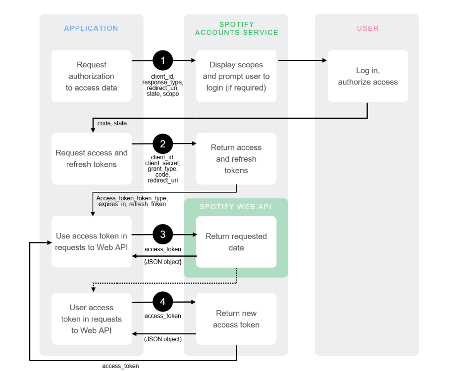

# Tabify
Try it yourself! https://tabify-app.herokuapp.com/
[](https://github.com/Nathanllee1/Tabify/actions/workflows/node.js.yml)

## Project Description:

When playing guitar, people put songs on spotify and jam along to them. If they want the tabs to the song, they'll usually google the chords to the song on https://www.ultimate-guitar.com/ which gets in the way of playing guitar. That's where Tabify comes in! Tabify connects to your Spotify account and automatically pulls up the tab of the song currently playing.


UI Prototype: https://www.figma.com/file/J7pzVQTY6Wv1YScIYKMDGf/Login-Page?node-id=0%3A1

## Environment Setup
Go to the [spotify developer dashboard](https://developer.spotify.com/dashboard/) and create a new app.  
Create a `.env` file with 2 variables.
```
SPOTIFY_CLIENT_ID='YOUR_CLIENT_ID'
SPOTIFY_CLIENT_SECRET='YOUR_CLIENT_SERE'
```
Run these commands to install dependencies and start the backend server and the frontend server.
```
npm install
npm run dev
```

To run the backend in a production environment, run  
```
npm run build
npm run prod
```

## Architecture Diagrams

### Class Diagram


### Component/Deployment Diagram


## Code Coverage 12/5/2021 6pm


File             | % Stmts | % Branch | % Funcs | % Lines | Uncovered Line #s 
-----------------|---------|----------|---------|---------|-------------------
All files        |    92.3 |       50 |     100 |    92.3 |                   
 tab-services.js |    90.9 |       50 |     100 |    90.9 | 16-29             
 tab.js          |     100 |      100 |     100 |     100 |                   


Test Suites: 1 passed, 1 total
Tests:       3 passed, 3 total
Snapshots:   0 total
Time:        1.892 s, estimated 3 s

The uncovered lines are database connection code.

## Style Check

For this project we're using Prettier as a style checker to ensure our code styles are consistent. To install using npm, you can run the following commands in the root directory:

`npm install --save-dev --save-exact prettier`

To let the editor know you're using Prettier:

`echo {}> .prettierrc.json`

Create a `.prettierignore` file to let the editor know which files NOT to style check.

Add these lines in .prettierignore

```
# Ignore artifacts:
build
coverage
```

To format all files, run

`npx prettier --write . `

Further instructions for installation can be found here:
https://prettier.io/docs/en/install.html

Style rules here:
https://prettier.io/docs/en/options.html

We recommend integrating Prettier into your chosen code editor (we recommend VSCode). Instructions on how to do so can be found here:
https://prettier.io/docs/en/editors.html


## Technical Details
### Authentication

The first part is authentication with Spotify using OAuth 2.0. I’ve done this before and have a reasonable idea how it works.

1. The express server redirects the website to the Spotify sign in.
2. The Spotify sign in page redirects back to the original page and returns tokens.
3. The express server grabs those tokens and stores them in the db.



### Playback

The website then uses the tokens to get the current user’s playback state. You can get how far they are, the current song, and some other stuff. This will be some kind of widget on the website.

The above two are actually implemented here, so we can use this:
https://developer.spotify.com/documentation/web-playback-sdk/guide/

### Webscraping

Once the website gets the current song playing, it will run a search on Ultimate Guitar and return the results for chords that the user can pick from. Ultimate Guitar doesn’t have an API, so we’ll have to implement this manually using a javascript web scraping library.

We could either do this on the frontend or backend.

## UI

For a bare minimum, we’ll need to make an authentication page, and some kind of playback page. I have some ideas for how to do it, but we’ll make a few components. We’ll make a currently playing song widget and a component for the chords. We could probably make it fancy and scroll as the song plays.

I’m not sure how heavily we need to rely on a database? I had this in mind to be completely frontend, but we could store the user tokens with song history or keep stats like number of songs played.

I think there’s not much point in storing the actual tabs in the database.
